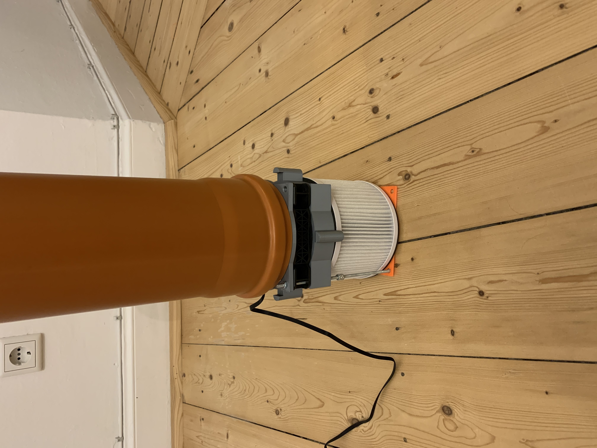
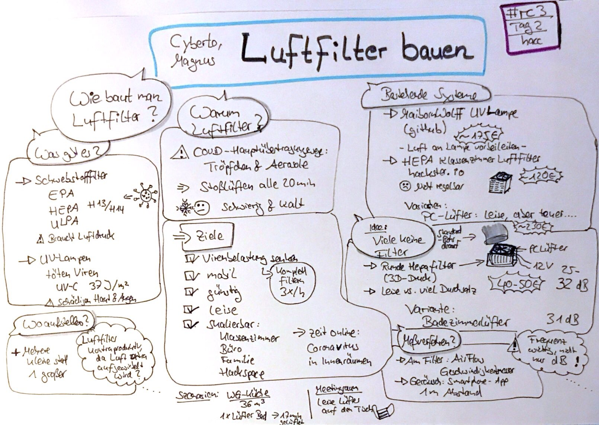

# air-filter

This repository contains the plans for an air-filter. The filter is intended to filter aerosols from the air, to which the corona viruses can be attached. 

Look [here](/documentation/idea.md) for the idea behind this project.

We gave a talk on this topic at rc3. The recording can be found [here](https://media.ccc.de/v/rc3-583039-luftfilter_bauen). 

[Miriam Busch](https://twitter.com/miphoni) drew this sketchnote about the talk:

## Related Projects
[Classroom Air Filter (de)](https://www.hackster.io/hhf/klassenzimmer-antivirus-raumluftfilter-4b0891) by [HHF](https://twitter.com/hhf) 

[Customizable circular mobile HEPA room air filter](https://www.thingiverse.com/thing:4860712) by [Sebastian Ritterbusch](https://twitter.com/sritterbusch) 
